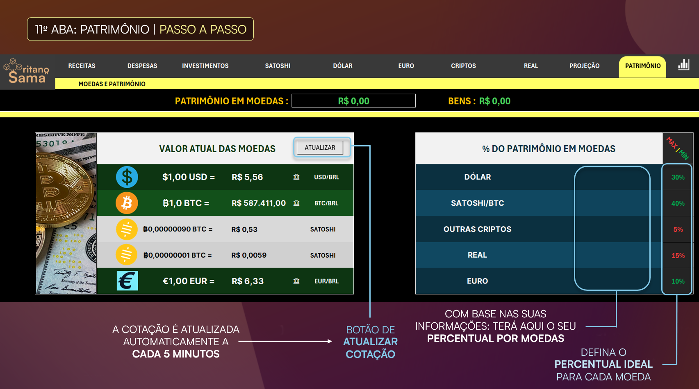

# 📑 Controle Financeiro Criptográfico em Excel (VBA)

Sistema avançado de controle financeiro, investimentos e projeções patrimoniais desenvolvido em Excel + VBA, com foco em automação, segurança, confiabilidade e simulação de cenários de curto, médio e longo prazo.


## Visão Geral

Este projeto consiste em uma planilha inteligente e automatizada criada para controle financeiro completo, contemplando:

* **Fluxo de caixa** detalhado.
* **Investimentos** em múltiplas moedas.
* **Diversificação patrimonial** automática.
* **Simulações de metas** financeiras.
* **Projeções de longo prazo** e aposentadoria.

O objetivo foi eliminar controles manuais, reduzir erros operacionais e permitir que o usuário visualize sua situação financeira e projeções futuras com mínima necessidade de input manual.

---

## Objetivo do Projeto

* Centralizar receitas, despesas e investimentos em uma única interface.
* Automatizar cálculos e projeções financeiras complexas.
* Incentivar a diversificação de patrimônio (**Real, Dólar, Euro, Bitcoin e outras criptos**).
* Simular cenários **realistas, ideais e pessimistas**.
* Garantir segurança, performance e proteção contra erros acidentais do usuário.

---

## Arquitetura da Solução

A planilha foi estruturada em camadas lógicas para garantir organização e escalabilidade:

### 🔹 Camada de Entrada
* Campos editáveis limitados e protegidos.
* Inputs mensais de receitas, despesas e investimentos.
* Definição de percentuais de alocação patrimonial.

### 🔹 Camada de Processamento
* Fórmulas financeiras avançadas.
* Macros em **VBA (Visual Basic for Applications)**.
* Módulos de projeção e simulação estatística.
* Classes para reaproveitamento de lógica de programação.

### 🔹 Camada de Visualização
* Dashboards visuais e interativos.
* Gráficos dinâmicos.
* Indicadores percentuais e monetários.
* Opção de ocultação de valores sensíveis (Modo Privacidade).

### 🔹 Camada de Segurança
* Duas camadas de senha.
* Proteção de células críticas e fórmulas.
* Controle estrito de acesso à edição.


<div align="center">
    


</div>

## Fonte e Atualização de Dados

### 💱 Cotações de Moedas
* **Origem:** Sistema de moedas nativo do Excel.
* **API externa:** ❌ Não utilizada (para evitar custos ou quebras de conexão).
* **Atualização:** ✅ Automática.

**Vantagens desta abordagem:**
1. Atualização confiável e nativa.
2. Menor dependência de serviços externos.
3. Maior estabilidade e velocidade da solução.

---

## Funcionalidades Principais

### 📌 Controle Financeiro Mensal
* Gestão de Receitas e Despesas (fixas e variáveis).
* Cálculo de saldo não investido.
* Totalização automática por mês e ano.

### 📌 Diversificação Patrimonial
Suporte para: **Real (CDI, CDB, Tesouro), Dólar, Euro, Bitcoin (Satoshi) e Altcoins.**
* O usuário define percentuais ideais por moeda.
* Moedas deixadas em branco são automaticamente desconsideradas nos cálculos para não poluir a visão.

### 🔮 Simuladores Financeiros

* **Simulador de Investimentos:** Sugere alocação baseada no que sobrou após as despesas e nos percentuais definidos.
* **Simulador de Meta:** Calcula o tempo necessário (em anos, meses e dias) para atingir um valor desejado em três cenários: **Ideal, Pior Cenário e Projetado.**
* **Aposentadoria:** Projeção de crescimento linear com ajustes de inflação configuráveis (6%, 8%, 12% ou personalizado).


## Estrutura Técnica (VBA)

* **Módulos:** 8 módulos de código.
* **Classes:** Utilização de módulos de classe para objetos.
* **Eventos:** Uso intensivo de eventos de planilha para automação em tempo real.

### Exemplos de Código

#### 🔹 Garantia de Confiabilidade dos Inputs
Este código garante que a célula J9 nunca fique vazia, evitando erros em fórmulas dependentes.

```vba
Private Sub Worksheet_Change(ByVal Target As Range)
    Dim rng As Range
    Set rng = Me.Range("J9")

    ' Verifica se a alteração ocorreu na célula monitorada
    If Not Intersect(Target, rng) Is Nothing Then
        Application.EnableEvents = False
        
        ' Se o usuário deletar o valor, o sistema redefine para 0
        If Target.Value = "" Then
            Target.Value = 0
        End If
        
        Application.EnableEvents = True
    End If
End Sub
```
> ➡️ **Motivo:** Evitar erros em cálculos dependentes e manter a integridade total da base de dados.

### 🔹 Reset Completo da Planilha (Performance)
Botão automatizado que apaga todas as informações e retorna ao estado inicial em um intervalo de **4 a 6 segundos**:

```vba
Sub RESETAR_PLANILHA()
    ' Limpa os intervalos de dados mantendo as fórmulas e estrutura
    Sheets("RECEITAS").Range("C6:N13").ClearContents
    Sheets("DESPESAS MENSAIS").Range("C7:N22").ClearContents
End Sub

```
**Utilizado para:**

* **Testes:** Limpeza rápida durante homologação.
* **Novo Ciclo:** Preparação da planilha para um novo ano/período financeiro.
* **Eficiência:** Evita a exclusão manual célula a célula, prevenindo erros de deleção acidental de fórmulas.

<div align="center">
  
</div>


## 🔐 Segurança e Proteção

A solução conta com camadas robustas de proteção:

* **Duas Senhas:** Proteção de abertura do arquivo e permissão de gravação.
* **Restrição de Edição:** O usuário só edita células permitidas; fórmulas e estruturas críticas estão bloqueadas.
* **Integridade do VBA:** Risco de quebra de lógica reduzido ao mínimo, acessível apenas via edição proposital no ambiente de desenvolvimento.

---

## 🚀 Performance e Escalabilidade

Pontos críticos resolvidos através de engenharia de software no Excel:

* **Controle de Eventos:** Uso estratégico de `EnableEvents` para evitar processamento desnecessário.
* **Macros Otimizadas:** Execução limpa e focada em intervalos específicos.
* **Escalabilidade:** Reset rápido e processamento estável mesmo com grande volume de dados.

---

## 📈 Confiabilidade e Uso Real

Este é um produto real e comercializado no mercado:

* **Pagamento:** Em moeda local e em satoshis/bitcoin Integrado via **Lightning Network** (NOWPayments).
* **Documentação:** Manual em PDF integrado para o usuário final.
* **Suporte:** [contato@samaritano.online](mailto:contato@samaritano.online)
* **Site Oficial:** [Samaritano](https://samaritano.online/produto/controlefinanceiro-avancado/)

---

## 📚 Principais Aprendizados

* **Modelagem financeira** avançada em ambiente Excel.
* **Desenvolvimento VBA** orientado a eventos e alta performance.
* **UX/UI** focado na proteção contra erro humano.
* **Simulação de cenários** financeiros complexos (Realista vs. Pessimista).
* **Arquitetura de soluções** robustas fora do ambiente tradicional de software.

---

## ⚠️ Observações Importantes

* Dados sensíveis e informações privadas foram removidos para este repositório.
* O código publicado é uma amostra representativa da lógica funcional.
* Estrutura adaptada exclusivamente para fins de portfólio técnico.

---

## 👤 Autor

Desenvolvido por [**Bruno P.**](https://github.com/bpb-bruno)
Email: [contato@brunopbrito.com.br](mailto:contato@brunopbrito.com.br)

